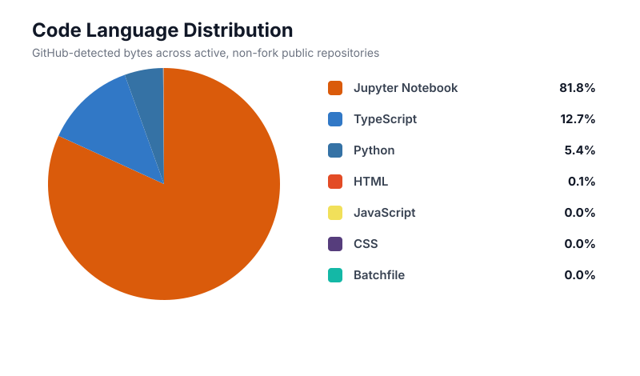
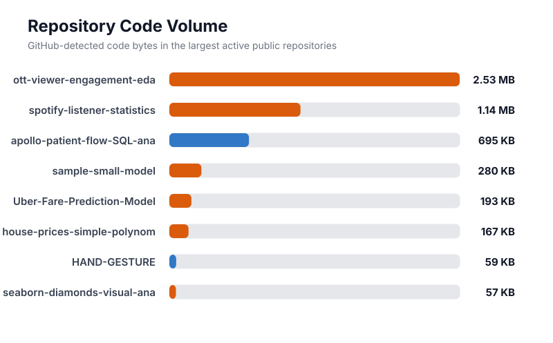
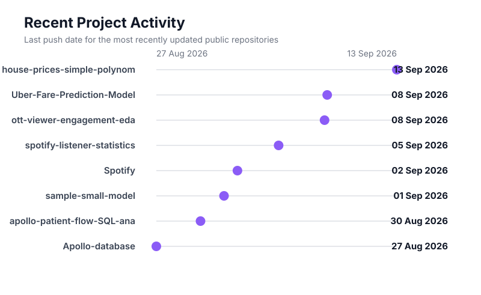

  

  
  &nbsp;&nbsp;
  
  &nbsp;&nbsp;
  

## 👋 About me

I am developing expertise in **Data Science, Artificial Intelligence, and Machine Learning** through structured professional training, supported by a completed course in **Digital Marketing**. I build practical projects using Python, SQL, analytics, and machine learning to uncover insights, solve business problems, and support measurable growth.

- **Current focus:** Python, SQL, exploratory data analysis, machine learning, and data visualization
- **Professional development:** Data Science, Artificial Intelligence, and Machine Learning
- **Business background:** Digital Marketing, SEO, audience insights, and growth strategy

<table width="100%">
  <tr>
    <td align="center" valign="top" width="33.33%">
      <strong>📊 Analytics</strong> 
      Clean data, uncover patterns, and communicate decisions
    </td>
    <td align="center" valign="top" width="33.33%">
      <strong>🧠 Machine Learning</strong> 
      Build, evaluate, and explain predictive models
    </td>
    <td align="center" valign="top" width="33.33%">
      <strong>⚡ Applied AI</strong> 
      Turn models into practical, interactive experiences
    </td>
  </tr>
</table>

## 🚀 Featured work

<table width="100%">
  <tr>
    <td width="50%" valign="top">
      <h3>🏥 <a href="https://github.com/mightyalok00/apollo-patient-flow-SQL-analysis">Apollo Patient Flow Analysis</a></h3>
      
End-to-end hospital operations analysis covering admissions, waiting times, readmissions, bed utilization, bottlenecks, and query optimization.

      
<strong>Project proof</strong> 2,500 admissions · 7,300 occupancy records · 4 hospitals · 15 analytical questions

      
<code>MySQL</code> <code>SQL</code> <code>Python</code> <code>CTEs</code> <code>Window Functions</code>

      
<a href="https://github.com/mightyalok00/apollo-patient-flow-SQL-analysis"><strong>View repository →</strong></a>

    </td>
    <td width="50%" valign="top">
      <h3>🖐️ <a href="https://github.com/mightyalok00/ai-hand-gesture-recognition">AI Hand Gesture Recognition</a></h3>
      
Real-time computer-vision application with webcam input, landmark tracking, confidence controls, temporal smoothing, and downloadable gesture history.

      
<strong>Project proof</strong> 11 gestures · Up to 2 hands · Real-time FPS · CSV export

      
<code>Python</code> <code>Streamlit</code> <code>MediaPipe</code> <code>OpenCV</code>

      
<a href="https://github.com/mightyalok00/ai-hand-gesture-recognition"><strong>View repository →</strong></a>

    </td>
  </tr>
  <tr>
    <td width="50%" valign="top">
      <h3>🛒 <a href="https://github.com/mightyalok00/mega-market-sales-dashboard">Mega Market Dashboard</a></h3>
      
Interactive dashboard for exploring sales, profit, customers, products, countries, store states, and returns from one business-focused interface.

      
<strong>Focus</strong> Executive KPIs · Customer analysis · Product performance · Regional insights

      
<code>Python</code> <code>Streamlit</code> <code>Pandas</code> <code>Data Visualization</code>

      
<a href="https://github.com/mightyalok00/mega-market-sales-dashboard"><strong>View repository →</strong></a>

    </td>
    <td width="50%" valign="top">
      <h3>💎 <a href="https://github.com/mightyalok00/seaborn-diamonds-visual-analysis">Diamonds Visual Analysis</a></h3>
      
Statistical exploration and visual analysis of the Seaborn diamonds dataset, designed to turn distributions and relationships into understandable insights.

      
<strong>Focus</strong> EDA · Statistical analysis · Visual storytelling · Interactive exploration

      
<code>Python</code> <code>Pandas</code> <code>Seaborn</code> <code>Jupyter</code>

      
<a href="https://github.com/mightyalok00/seaborn-diamonds-visual-analysis"><strong>View repository →</strong></a>

    </td>
  </tr>
</table>

## 🧰 Technical toolkit

  
  
  
  
  
  
  
  
  
  

## 🎯 Currently exploring

  
  
  
  
  
  

## 📈 GitHub snapshot

  <a href="https://github.com/mightyalok00"><strong>GitHub profile</strong></a>
  &nbsp;•&nbsp;
  <a href="https://github.com/mightyalok00?tab=repositories"><strong>Public repositories</strong></a>
  &nbsp;•&nbsp;
  <a href="https://github.com/mightyalok00"><strong>Contribution history</strong></a>

### 💻 Code Language Distribution

  

Generated from GitHub's byte-level language data for active, non-fork public repositories.

### 📦 Repository Code Volume

  

### 🕒 Recent Project Activity

  

## 📊 Contribution activity

My contribution calendar and activity history are maintained directly by GitHub.

[**View my live GitHub contribution history →**](https://github.com/mightyalok00)

## 🐍 Contribution snake

  <picture>
    <source media="(prefers-color-scheme: dark)" srcset="https://raw.githubusercontent.com/mightyalok00/mightyalok00/output/github-contribution-grid-snake-dark.svg" />
    <source media="(prefers-color-scheme: light)" srcset="https://raw.githubusercontent.com/mightyalok00/mightyalok00/output/github-contribution-grid-snake.svg" />
    
  </picture>

---

  <strong>Interested in data, machine learning, or applied AI?</strong> 
  Explore my repositories and let us build something useful.

## 🆕 Latest repositories

<!-- LATEST-REPOS:START -->
- [**Uber-fare-prediction-ml**](https://github.com/mightyalok00/Uber-fare-prediction-ml) — End-to-end Uber fare prediction ML project using Python, Scikit-learn, feature engineering, EDA, Gradient Boosting, model evaluation, and Streamlit.
- [**ott-viewer-engagement-eda**](https://github.com/mightyalok00/ott-viewer-engagement-eda) — Exploratory Data Analysis of synthetic OTT viewer engagement, drop-off and retention patterns using Python, Pandas, NumPy, Matplotlib and Seaborn. (Jupyter Notebook)
- [**spotify-listener-statistics-eda**](https://github.com/mightyalok00/spotify-listener-statistics-eda) — Spotify Listener Statistics EDA using Python, Pandas, NumPy, Matplotlib, and Seaborn to analyze streaming trends, listener engagement, top artists, genres, albums, countries, skip rates, and Free vs Premium behavior. (Jupyter Notebook)
- [**Spotify**](https://github.com/mightyalok00/Spotify) — Spotify Project
- [**sample-small-model**](https://github.com/mightyalok00/sample-small-model) — model test (Jupyter Notebook)
- [**apollo-patient-flow-SQL-analysis**](https://github.com/mightyalok00/apollo-patient-flow-SQL-analysis) — End-to-end MySQL 8.0 analysis of a synthetic hospital patient-flow dataset using joins, CTEs, window functions, indexes and query optimization to examine admissions, waiting times, readmissions, bed utilization and operational bottlenecks. (TypeScript · ⭐ 1)
<!-- LATEST-REPOS:END -->
